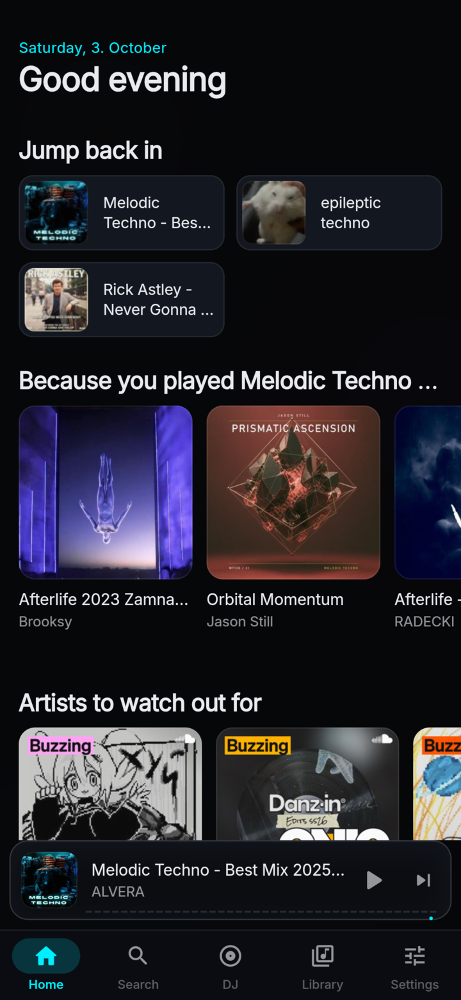
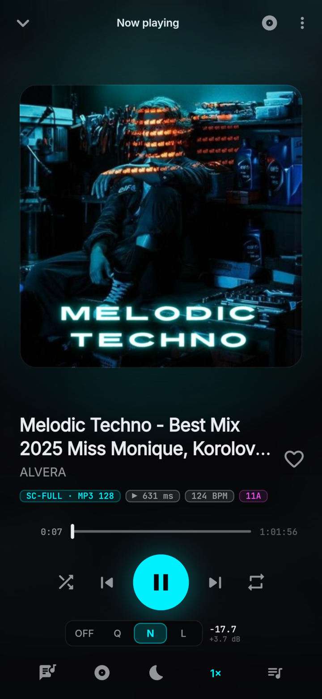
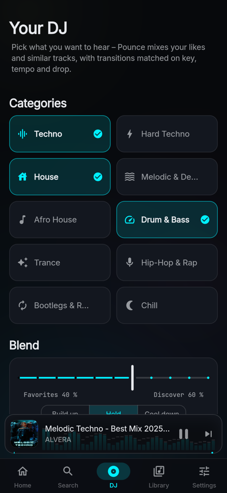
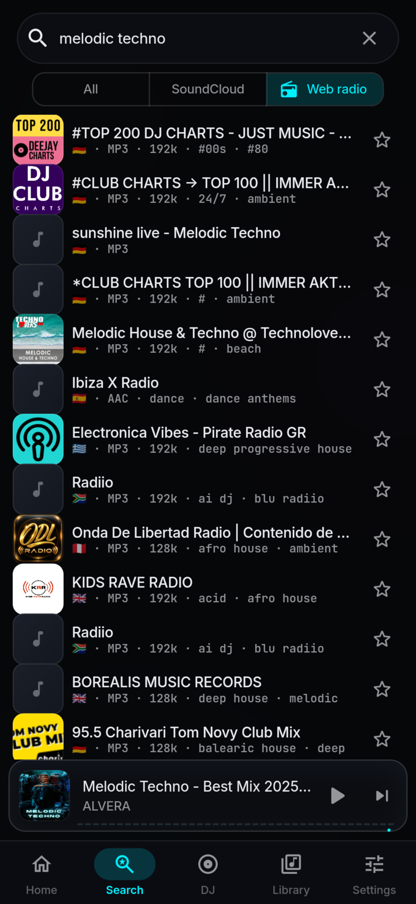
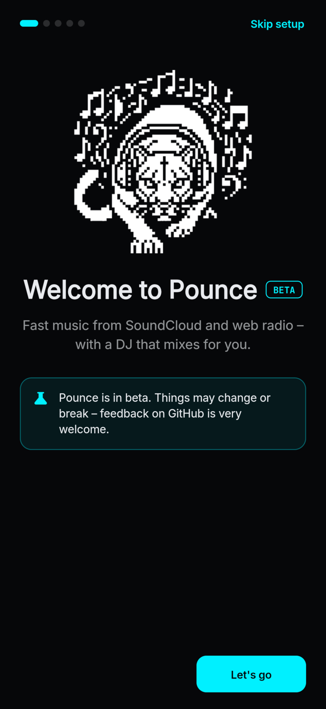
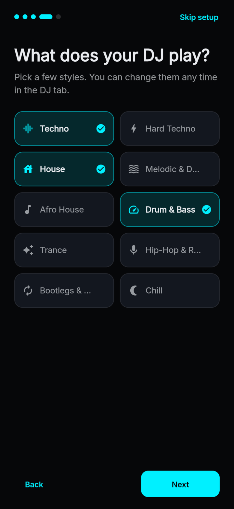
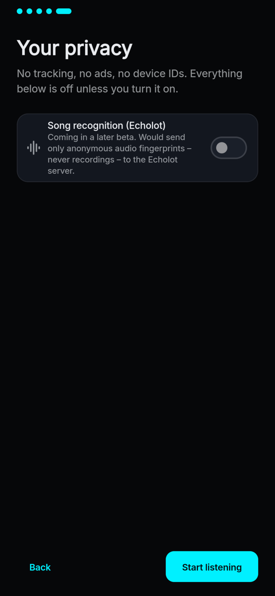
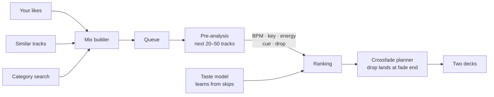

<p align="center">
  
</p>

<p align="center">
  <b>Fast, open-source music player for SoundCloud & web radio – with a DJ that mixes for you.</b>
</p>

<p align="center">
  <a href="https://github.com/jason-fastner007/Pounce/releases"></a>
  <a href="https://github.com/jason-fastner007/Pounce/actions/workflows/ci.yml"></a>
  
  <a href="LICENSE"></a>
  <br>
  
  
  <a href="https://github.com/jason-fastner007/deckengine"></a>
  
</p>

<p align="center">
  <a href="#-install">Install</a> ·
  <a href="#-features">Features</a> ·
  <a href="#-the-dj">The DJ</a> ·
  <a href="#-privacy">Privacy</a> ·
  <a href="#-build-from-source">Build</a> ·
  <a href="#-roadmap">Roadmap</a>
</p>

> [!IMPORTANT]
> **Pounce is in beta.** It's used daily on Android, but things can still change or break.
> Found a bug? [Open an issue](../../issues/new/choose) – reports from real devices help the most.

<p align="center">
  
  
  
  
</p>

<details>
<summary>First-run setup</summary>
<p align="center">
  
  
  
</p>
</details>

## ✦ Why Pounce

|  |  |
|---|---|
| ⚡ **Starts fast** | Tapped tracks start from a progressive MP3 stream instead of HLS, and the next song is pre-buffered on a second player deck while the current one plays. |
| 🎛 **A real DJ mode** | Pick a few styles and Pounce builds a mix from your likes and similar tracks – beat-matched, key-aware, with crossfades that land on the drop. |
| 🧠 **Learns from skips** | Skip early and that song leaves your mixes. Skips and full listens shift the weights for artist, style, tempo and energy. |
| 📻 **Web radio built in** | 30,000+ stations from [radio-browser.info](https://www.radio-browser.info), favourites, and live "now playing" titles. One search for everything. |
| 🔒 **Private by default** | No account needed, no analytics, no ads, no device IDs. Every network feature beyond playback is opt-in. |
| 🦀 **Rust under the hood** | Beat grid, key (chroma), loudness, cue and drop detection run in a native Rust engine ([`deckengine`](https://github.com/jason-fastner007/deckengine)) via `dart:ffi`. |

## ✦ Install

**Android (recommended):** download the latest `pounce-<version>-arm64-v8a-github.apk` from
[Releases](../../releases) and open it. Pre-releases are marked *beta*.

<details>
<summary>Verify the download (optional)</summary>

Every release ships a `SHA256SUMS` file:

```sh
sha256sum -c SHA256SUMS --ignore-missing
```

The in-app updater does the same check automatically before installing an update.
</details>

Pounce currently supports **arm64 Android devices** (practically every phone from the last years).
Builds for iOS, web, Linux, Windows and macOS compile from the same code base but are less tested –
see [Build from source](#-build-from-source).

> [!WARNING]
> **iOS is untested:** While Pounce can be compiled for iOS (using AVPlayer for audio), it has **not been tested on real iOS devices**. Experimental builds are generated in CI for testing purposes, but unexpected bugs or audio playback issues may occur. Feedback and reports from real iOS devices are welcome!

## ✦ Features

<details open>
<summary><b>Playback</b></summary>

- Dual-deck player on Android (Media3 ExoPlayer) with gapless pre-buffering and centralised audio focus
- Fast start: progressive MP3 for tapped tracks, high-quality HLS for pre-buffered ones
- Loudness normalisation (ITU-R BS.1770) with three target levels and a soft limiter
- Synced lyrics from LRCLIB and KuGou – tap a line to jump there
- Queue, shuffle, repeat, autoplay radio, sleep timer
- Lock-screen, notification, Bluetooth and headset controls
- 30-second previews are labelled and can be skipped automatically
</details>

<details>
<summary><b>Library & sources</b></summary>

- SoundCloud: home feed, search (tracks, playlists, albums, artists), paste any link
- Works **without an account**; optionally sign in to bring your likes and playlists along
- Local library: likes, history and your own playlists, stored on the device (SQLite)
- Web radio via radio-browser.info: top stations, favourites, ICY "now playing" metadata, DNS-based mirror fail-over
- Unified search with a source filter: *All · SoundCloud · Web radio*
- Peer-to-peer sync between your devices on the local network (pairing code, no cloud)
</details>

<details>
<summary><b>Look & feel</b></summary>

- Dark studio design with a single accent colour – fixed, or taken from the current cover
- Optional background that pulses with the detected beat
- First-run setup wizard (sources, account, DJ styles, privacy)
- 7 languages: English, German, French, Russian, Hungarian, Vietnamese, Arabic (full RTL)
- Phone, tablet and desktop layouts
</details>

<details>
<summary><b>Updates</b></summary>

- **GitHub build:** opt-in update check (at most once a day, one anonymous request to the GitHub API),
  download only after you confirm, SHA-256 verified before install
- **Play build:** uses Google Play's in-app update flow
</details>

## ✦ The DJ



1. **Pick styles** in the DJ tab (Techno, House, Drum & Bass, …) and choose how much is new vs. familiar.
2. **Pre-analysis:** Pounce decodes short clips of the upcoming 20–50 tracks in Rust and finds tempo, key,
   energy, the first downbeat (*cue*) and the *drop*.
3. **Ranking:** the next track is chosen by harmonic and tempo fit, energy curve and your taste profile.
4. **Transition:** the incoming track is tempo-matched and started so that its drop hits exactly when the fade
   ends. Skipping triggers a short, clean crossfade instead of a hard cut.
5. **Learning:** full listens and likes raise artist, style, tempo and energy scores; skips lower them; a very
   early skip removes the song from future mixes. Older signals fade out over time.

The DJ only plays full tracks – no 30-second previews and no hour-long mixes.

## ✦ Privacy

| | |
|---|---|
| Analytics, ads, crash reporters | **None** |
| Account | Optional (SoundCloud sign-in, only to import likes/playlists) |
| Device or advertising IDs | **Never** sent |
| Update check | **Off** by default; one request to `api.github.com` with a neutral `Pounce-Client/<version>` user agent |
| Web radio | Can be switched off completely – then Pounce makes no request to radio-browser.info |
| Song recognition (Echolot) | Not active yet. Planned as opt-in, sending only anonymous audio fingerprints (computed on the device), never recordings |
| Your library | Stored locally in SQLite; sync is device-to-device on your network |

## ✦ Build from source

```sh
git clone https://github.com/jason-fastner007/Pounce.git && cd pounce
flutter pub get
flutter run --flavor github          # Android
flutter run -d linux                 # Linux, needs libmpv (pacman -S mpv / apt install libmpv2)
```

| Flavor | For | Updates via |
|---|---|---|
| `github` | GitHub Releases, sideloading | in-app updater (GitHub Releases, SHA-256 verified) |
| `play` | Google Play | Play in-app updates |

Release signing, the web build (CORS proxy), desktop notes and the Rust engine are covered in
**[docs/BUILDING.md](docs/BUILDING.md)**.

<details>
<summary>Project structure</summary>

```
lib/
  core/        settings, SQLite store, dependency container
  sc/          SoundCloud client
  player/      player controller + platform audio engines
  dj/          DJ flow, beat analysis, mix builder, taste model
  radio/       radio-browser.info client and station playback
  lyrics/      LRC parser, LRCLIB, KuGou
  library/     likes, history, playlists, account
  sync/        peer-to-peer sync
  modules/     self-contained modules (updater)
  ui/          shell, pages, player, widgets
packages/
  native_player/   Android (Kotlin, Media3) and iOS/macOS (Swift) playback
  native_auth/     native sign-in helpers
tool/          code generators and build scripts
```
</details>

| Platform | Audio engine | System controls |
|---|---|---|
| Android | Media3 ExoPlayer (two decks) in a `MediaSessionService` | notification, lock screen, Bluetooth |
| iOS / macOS | AVPlayer | Now Playing, remote commands |
| Web | `<audio>` (native HLS or hls.js) | Media Session API |
| Linux / Windows | libmpv via `dart:ffi` | – |

## ✦ Roadmap

- [x] DJ mode with cue/drop-aware transitions and skip learning
- [x] Web radio
- [x] In-app updater with checksum verification
- [x] Setup wizard
- [ ] Local music files as a source
- [ ] Song recognition (Echolot) in the app – opt-in
- [ ] Google Play release
- [ ] System media controls on Linux (MPRIS) and Windows (SMTC)

## ✦ Contributing

Bug reports, translations and pull requests are welcome – see [CONTRIBUTING.md](CONTRIBUTING.md).
Security issues: please follow [SECURITY.md](SECURITY.md).

## ✦ Credits

- Inspired by **[KittyTune](https://github.com/alan7383/kittytune)** by alan7383 – thank you for showing how good a
  SoundCloud player can be. Pounce is a separate app, written from scratch in Flutter.
- Station data: [radio-browser.info](https://www.radio-browser.info) (community-run, free API)
- Lyrics: [LRCLIB](https://lrclib.net) and KuGou
- Fonts: Inter and JetBrains Mono (SIL Open Font License)

Pounce is not affiliated with SoundCloud. All trademarks belong to their owners.

## ✦ License

Pounce is licensed under the [GPL-3.0](LICENSE) © Pounce contributors.

The bundled audio-analysis engine [deckengine](https://github.com/jason-fastner007/deckengine) is maintained in its own repository and licensed separately under
the AGPL-3.0-or-later (commercial licenses available from its author); GPL-3.0 and AGPL-3.0 code may be combined
under section 13 of both licenses.
